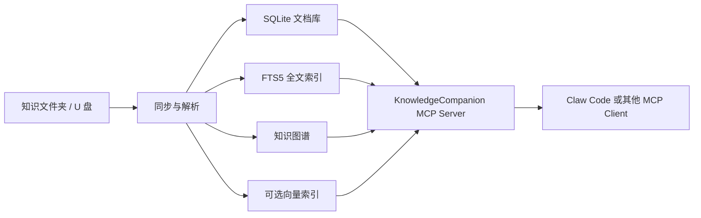

# KnowledgeCompanion

<p align="center">
  Portable personal knowledge base · MCP server · Local-first retrieval
</p>

<p align="center">
  <a href="#功能概览">功能概览</a>
  ·
  <a href="#快速开始">快速开始</a>
  ·
  <a href="#mcp-工具">MCP 工具</a>
  ·
  <a href="#项目结构">项目结构</a>
  ·
  <a href="#当前状态">当前状态</a>
</p>

KnowledgeCompanion 是一个使用 Rust 编写的便携式私人知识库 MCP Server。
它可以扫描本地或 U 盘中的 Markdown、TXT、PDF、DOCX 文件，建立全文索引、知识图谱和可选向量索引，再通过 MCP 工具提供搜索、问答、同步和文档管理能力。

这个项目的目标很直接：把个人资料放进一个文件夹，就能随身携带一套可检索、可问答、可接入 AI Agent 的知识库。即使没有配置 LLM 或 embedding API，基础全文搜索仍然可用。

> [!NOTE]
> 本仓库是 KnowledgeCompanion 的核心源码。面向普通用户的 U 盘交付包还会包含跨平台二进制文件、启动脚本、配置模板和配套 Agent。

## 功能概览

- **便携式知识库**：支持 U 盘、本地文件夹和只读知识目录。
- **多格式解析**：支持 Markdown、TXT、PDF 和 DOCX。
- **中文全文搜索**：使用 SQLite FTS5，并接入 `jieba-rs` 中文分词。
- **知识图谱**：提取文档、标题、标签和 `[[wikilink]]` 关系。
- **可选语义检索**：支持 OpenAI-compatible embedding API。
- **RAG 问答**：LLM 可用时生成带引用的回答；不可用时降级为检索结果。
- **术语表与翻译记忆**：适合需要统一专业词汇的资料库。
- **增量同步**：扫描新增、修改和删除文件，避免每次全量重建。
- **事务保护**：索引、删除、恢复和重建操作使用 SQLite 事务。
- **MCP 接入**：可通过标准输入输出或 HTTP MCP 接入 Agent。

## 工作方式



## 快速开始

### 1. 构建

```bash
git clone https://github.com/a976xw7td/knowledge-companion.git
cd knowledge-companion
cargo build --release --bins
```

构建完成后会生成两个程序：

- `target/release/knowledge-companion`：MCP Server
- `target/release/kcctl`：维护、同步和诊断命令行工具

### 2. 初始化目录

```bash
mkdir -p ./KnowledgeSuite
./target/release/kcctl --bundle-root ./KnowledgeSuite init
```

将资料放入：

```text
KnowledgeSuite/knowledge/
```

### 3. 同步知识库

```bash
./target/release/kcctl --bundle-root ./KnowledgeSuite sync
```

### 4. 检查状态

```bash
./target/release/kcctl --bundle-root ./KnowledgeSuite health
./target/release/kcctl --bundle-root ./KnowledgeSuite doctor
./target/release/kcctl --bundle-root ./KnowledgeSuite db integrity-check
```

### 5. 配置 MCP Client

```json
{
  "mcpServers": {
    "knowledge-companion": {
      "command": "/absolute/path/to/knowledge-companion",
      "args": [],
      "env": {
        "KC_BUNDLE_ROOT": "/absolute/path/to/KnowledgeSuite"
      }
    }
  }
}
```

## 可选 API 配置

默认情况下，基础全文搜索不需要 API Key。

如需启用问答、翻译和向量检索，可设置：

```bash
export KC_LLM_API_KEY="your-key"
export KC_EMBED_API_KEY="your-key"
```

配置文件位于：

```text
config/knowledge-companion.toml
```

其中 LLM 和 embedding 服务均可配置为 OpenAI-compatible API。

## MCP 工具

KnowledgeCompanion 暴露了一组适合 Agent 调用的工具：

| 分类 | 工具 |
| --- | --- |
| 健康检查 | `health_check`, `get_knowledge_stats`, `get_sync_status` |
| 同步管理 | `sync_now`, `configure_watch_folder`, `list_watch_folders`, `rebuild_index` |
| 文档管理 | `list_documents`, `get_document`, `forget_document`, `reindex_document` |
| 搜索问答 | `search_knowledge`, `ask_question`, `get_sources` |
| 知识图谱 | `search_graph`, `explore_graph_node` |
| 翻译术语 | `translate_text`, `add_glossary_entry`, `update_glossary_entry`, `delete_glossary_entry`, `list_glossary` |

## U 盘交付场景

KnowledgeCompanion 可以作为便携式知识库核心使用：

```text
KnowledgeSuite/
├── bin/
│   ├── linux-arm64/
│   ├── macos-arm64/
│   └── windows-x64/
├── config/
├── data/
├── knowledge/
├── scripts/
└── workspace/
```

使用者将资料放进 `knowledge/`，运行启动脚本后即可同步和搜索。
源码仓库不会包含用户私人知识库、API Key、运行日志或数据库文件。

## 项目结构

```text
src/
├── bin/          # MCP Server 与 kcctl
├── config/       # 配置和 bundle root
├── db/           # SQLite 连接与迁移
├── ingest/       # 文档解析与分块
├── index/        # FTS、向量和知识图谱索引
├── mcp/          # MCP 协议与工具适配
├── rag/          # 检索增强问答和引用
├── retrieve/     # 混合检索
├── sync/         # 扫描、计划、同步与后台任务
└── translate/    # 翻译记忆与术语表
```

## 开发验证

```bash
cargo fmt --check
cargo clippy --all-targets -- -D warnings
cargo test --all-targets
```

## 当前状态

项目仍处于早期开发阶段，核心同步、检索、图谱和 MCP 工具已经可用。

已知限制：

- embedding 后台任务队列已经建立，但常驻 worker 仍需继续完善。
- 扫描版 PDF 不支持 OCR，需要先转换为可搜索 PDF。
- 大规模并发写入目前由同步互斥锁保护，适合个人知识库和轻量团队场景，不是分布式检索服务。

## 相关项目

- [Claw Code](https://github.com/ultraworkers/claw-code)：可配合 KnowledgeCompanion 使用的 CLI Agent Harness。
- [a976xw7td/claw-code](https://github.com/a976xw7td/claw-code)：用于当前 KnowledgeSuite 集成的 Fork。

## 安全说明

- 不要将 API Key 写入仓库。
- 对外开放 HTTP MCP 时，请设置 `KC_HTTP_MCP_TOKEN`。
- 对外商业交付前，请检查第三方组件许可证，并将许可证文件随产品一并提供。

